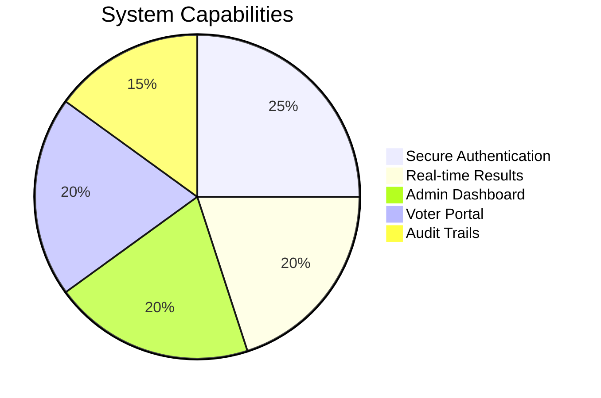
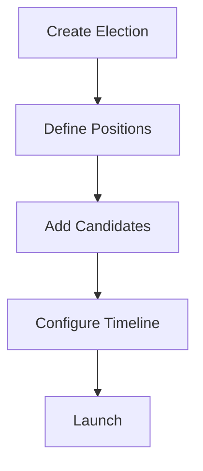
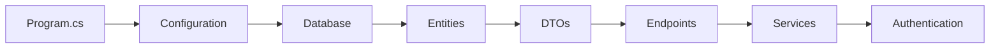
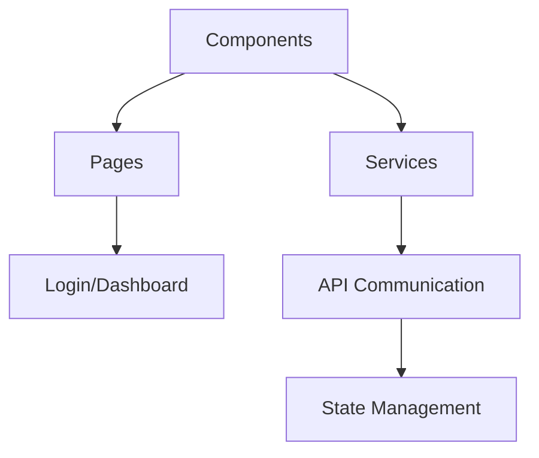

---

<div align="center">
  <h3>✨ Built by 0x4B47 developers with love for democratic innovation ✨</h3>
  
</div>

---


```markdown
# 🗳️ Online Voting System - Secure Digital Democracy

```diff
+---------------------------------------------------------------+
|  🚀 Modern | 🔐 Secure | ⚡ Efficient | 🎯 User-Friendly       |
+---------------------------------------------------------------+
```

## 🌟 Project Overview
**`OnlineVotingSystem.api.git`** is a full-stack solution revolutionizing democratic processes through technology. This system combines a robust .NET Core backend with an interactive Blazor frontend to deliver:



## 🎨 Feature Showcase

### 🔑 Authentication Suite
```diff
+ JWT Token Security
+ Role-based Access Control
+ Password Hashing (BCrypt)
```

### 📊 Election Management


### 🗳️ Voting Experience
```diff
+ One-Vote-Per-User Enforcement
+ Anonymous Ballot System
+ Real-time Vote Counting
```

## 🏗️ Project Architecture

### 🖥️ Backend Structure (`OnlineVotingSystem.api`)


#### Core Components:
- **`Data/`**  
  🗃️ EF Core Context & Migrations  
  ```sql
  CREATE TABLE Users (
    Id INT PRIMARY KEY,
    Username NVARCHAR(50) UNIQUE,
    -- ... other fields
  );
  ```
  
- **`Endpoints/`**  
  🚪 API Gateways  
  ```csharp
  app.MapPost("/api/votes", (CreateVoteDto dto) => {
      // Voting logic
  }).RequireAuthorization();
  ```

### 💻 Frontend Structure (`WebUI`)


#### Key Features:
- **Blazor WASM Hybrid SSR**  
  ⚡ Combines server-side and client-side rendering  
- **Syncfusion Integration**  
  📊 Beautiful data visualization for results  
- **JWT Interceptor**  
  🔐 Automatic token handling

## 🛠️ Developer Quickstart
## 🚀 Getting Started
 
 ### ☑️ Prerequisites
 
 Before getting started with `OnlineVotingSystem.api.git`, ensure your runtime environment meets the following requirements:
 
 - **Programming Language:** CSharp
 - **Package Manager:** Nuget
 - **Database:** SQLite
 - **.NET SDK:** Ensure you have the .NET SDK installed. You can download it from the [official .NET website](https://dotnet.microsoft.com/download).
 
 ### ⚙️ Installation
 **THIS INSTRUCTIONS WILL WORK FOR 99.9% AND FOR THAT 0.1% HELP YOURSELF MAN!**
 
 #### Clone the Repository
 
 1. Clone the `OnlineVotingSystem.api.git` repository:
    ```bash
    ❯ git clone https://github.com/Flow-Pie/OnlineVotingSystem.api.git
    ```
 
 2. Navigate to the project directory:
    ```bash
    ❯ cd OnlineVotingSystem.api.git
    ```
 
 #### Cleaning the project
 
 3. Clean the project:
    ```bash
    ❯ dotnet clean
    ```
    #### Build the project
 
 4. Build the project:
    ```bash
    ❯ dotnet build
    ```
    #### Restore Dependencies
 
 5. Restore the project dependencies using NuGet:
    ```bash
    ❯ dotnet restore
    ```
 
 ### 🤖 Running the Projects
 
 The solution contains two projects: `OnlineVotingSystem.api` and application layer `WebUI`. Follow the steps below to run each project.
 
 #### Running `OnlineVotingSystem.api`
 
 1. Navigate to the `OnlineVotingSystem.api` directory:
    ```bash
    ❯ cd OnlineVotingSystem.api
    ```
 
 2. Run the project:
    ```bash
    ❯ dotnet run 
    ```
 
 #### Running `Interface Application layer ie WebUI`
 
 1. Navigate to the `WebUI` directory:
    ```bash
    ❯ cd WebUI
    ```
 
 2. Run the project:
    ```bash
    ❯ dotnet run 
    ```
 
 The User Interface will launch
 
 ### 🧪 Testing(optional)
 
 To run the test suite, use the following command:
 
 ```bash
 + dotnet test

### 🏗️ Installation
```bash
# Clone with style!
git clone https://github.com/Flow-Pie/OnlineVotingSystem.api.git && \
cd OnlineVotingSystem.api && \
echo "🚀 Repository cloned successfully!"
```

### ⚙️ Setup Guide summary
```diff
+ dotnet restore   # Get all dependencies
! dotnet build     # Compile the solution
# dotnet run       # Launch the API
```

### 🔄 Database Migrations
```csharp
// Sample migration command
dotnet ef migrations add "InitialSchema" -o "Data/Migrations"
```

## 📊 Technology Stack

| Layer        | Technology                 | Badge                                                                 |
|--------------|----------------------------|-----------------------------------------------------------------------|
| **Frontend** | Blazor WASM                |     |
| **Backend**  | ASP.NET Core 8             |         |
| **Database** | SQLite/PostgreSQL          |     |
| **Auth**     | JWT Bearer Tokens          |  |

## 🌈 UI Component Gallery

```
[Login Screen]        [Dashboard]         [Election Creation]
  ┌─────────────┐     ┌─────────────┐     ┌─────────────┐
  │             │     │  📊 Charts  │     │  🏗️ Form   │
  │   🔐 Auth   │     │  📈 Stats   │     │  📝 Fields  │
  └─────────────┘     └─────────────┘     └─────────────┘
```

## 🚀 Deployment Options

1. **Azure App Service**  
   ```bash
   az webapp up --name voting-system --resource-group DemoSite
   ```
2. **Docker Container**  
   ```dockerfile
   FROM mcr.microsoft.com/dotnet/aspnet:8.0
   COPY ./published /app
   WORKDIR /app
   ENTRYPOINT ["dotnet", "OnlineVotingSystem.api.dll"]
   ```

## 🤝 Contribution Guidelines

```diff
! We welcome contributions! Please follow our:
+ Code Style Guidelines
+ PR Template Requirements
+ Security Protocols
```

📌 **Pro Tip:** Use our pre-commit hooks for automatic code formatting!

## 📜 License
```diff
+ MIT Licensed - Open Source Forever
- Commercial Use Allowed
! Attribution Required
```
