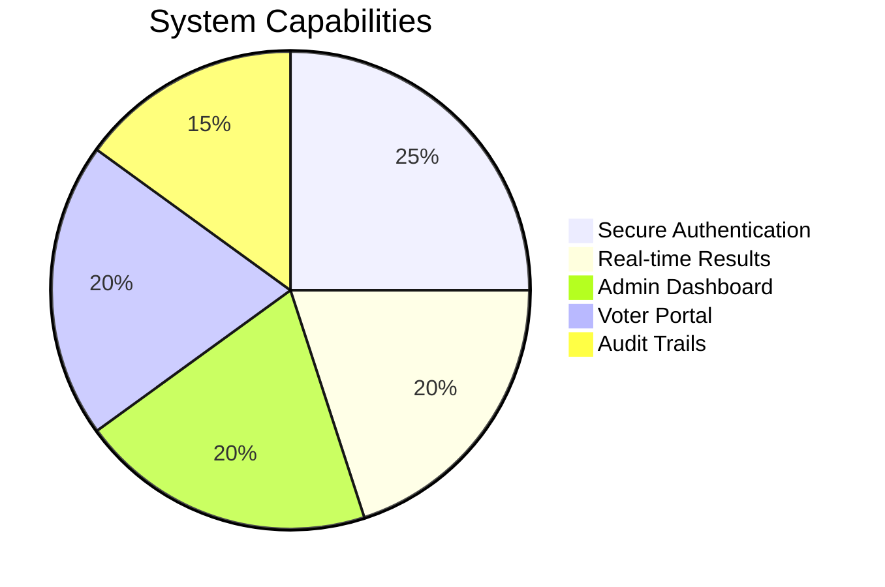
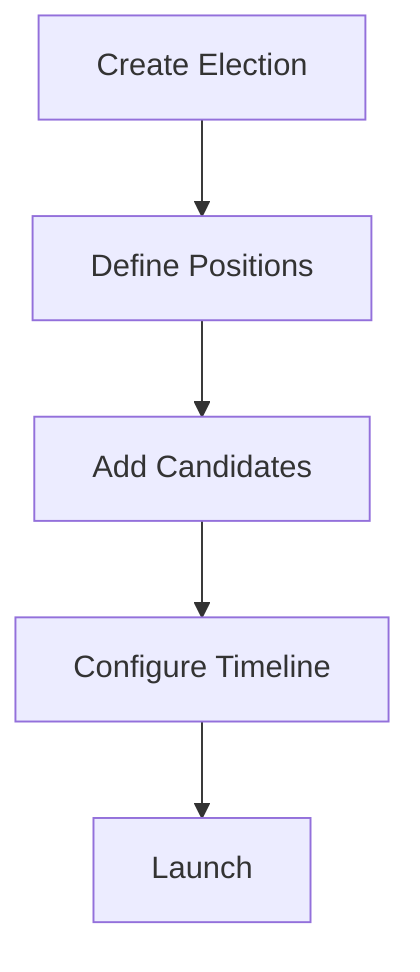
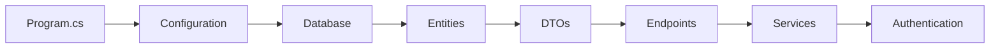
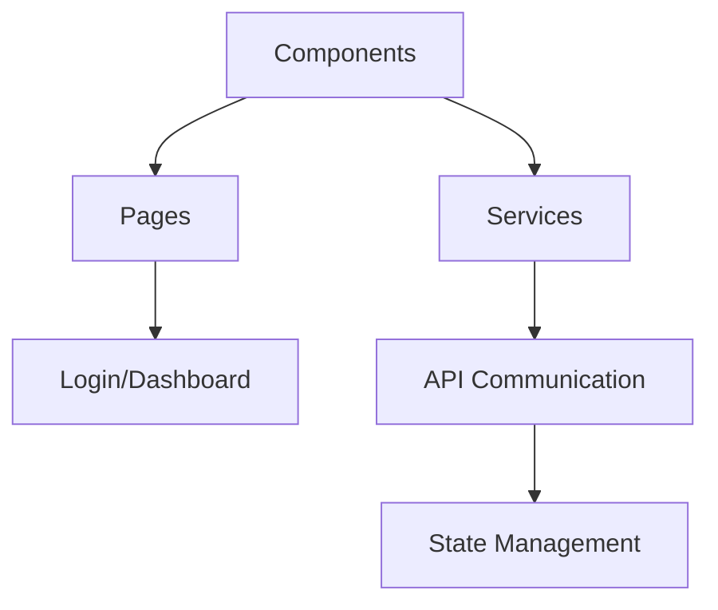

Here's a creatively styled Markdown documentation for your Online Voting System project with visual enhancements:

```markdown
# 🗳️ Online Voting System - Secure Digital Democracy

```diff
+---------------------------------------------------------------+
|  🚀 Modern | 🔐 Secure | ⚡ Efficient | 🎯 User-Friendly       |
+---------------------------------------------------------------+
```

## 🌟 Project Overview
**`OnlineVotingSystem.api.git`** is a full-stack solution revolutionizing democratic processes through technology. This system combines a robust .NET Core backend with an interactive Blazor frontend to deliver:



## 🎨 Feature Showcase

### 🔑 Authentication Suite
```diff
+ JWT Token Security
+ Role-based Access Control
+ Password Hashing (BCrypt)
```

### 📊 Election Management


### 🗳️ Voting Experience
```diff
+ One-Vote-Per-User Enforcement
+ Anonymous Ballot System
+ Real-time Vote Counting
```

## 🏗️ Project Architecture

### 🖥️ Backend Structure (`OnlineVotingSystem.api`)


#### Core Components:
- **`Data/`**  
  🗃️ EF Core Context & Migrations  
  ```sql
  CREATE TABLE Users (
    Id INT PRIMARY KEY,
    Username NVARCHAR(50) UNIQUE,
    -- ... other fields
  );
  ```
  
- **`Endpoints/`**  
  🚪 API Gateways  
  ```csharp
  app.MapPost("/api/votes", (CreateVoteDto dto) => {
      // Voting logic
  }).RequireAuthorization();
  ```

### 💻 Frontend Structure (`WebUI`)


#### Key Features:
- **Blazor WASM Hybrid SSR**  
  ⚡ Combines server-side and client-side rendering  
- **Syncfusion Integration**  
  📊 Beautiful data visualization for results  
- **JWT Interceptor**  
  🔐 Automatic token handling

## 🛠️ Developer Quickstart

### 🏗️ Installation
```bash
# Clone with style!
git clone https://github.com/Flow-Pie/OnlineVotingSystem.api.git && \
cd OnlineVotingSystem.api && \
echo "🚀 Repository cloned successfully!"
```

### ⚙️ Setup Guide
```diff
+ dotnet restore   # Get all dependencies
! dotnet build     # Compile the solution
# dotnet run       # Launch the API
```

### 🔄 Database Migrations
```csharp
// Sample migration command
dotnet ef migrations add "InitialSchema" -o "Data/Migrations"
```

## 📊 Technology Stack

| Layer        | Technology                 | Badge                                                                 |
|--------------|----------------------------|-----------------------------------------------------------------------|
| **Frontend** | Blazor WASM                |     |
| **Backend**  | ASP.NET Core 8             |         |
| **Database** | SQLite/PostgreSQL          |     |
| **Auth**     | JWT Bearer Tokens          |  |

## 🌈 UI Component Gallery

```
[Login Screen]        [Dashboard]         [Election Creation]
  ┌─────────────┐     ┌─────────────┐     ┌─────────────┐
  │             │     │  📊 Charts  │     │  🏗️ Form   │
  │   🔐 Auth   │     │  📈 Stats   │     │  📝 Fields  │
  └─────────────┘     └─────────────┘     └─────────────┘
```

## 🚀 Deployment Options

1. **Azure App Service**  
   ```bash
   az webapp up --name voting-system --resource-group DemoSite
   ```
2. **Docker Container**  
   ```dockerfile
   FROM mcr.microsoft.com/dotnet/aspnet:8.0
   COPY ./published /app
   WORKDIR /app
   ENTRYPOINT ["dotnet", "OnlineVotingSystem.api.dll"]
   ```

## 🤝 Contribution Guidelines

```diff
! We welcome contributions! Please follow our:
+ Code Style Guidelines
+ PR Template Requirements
+ Security Protocols
```

📌 **Pro Tip:** Use our pre-commit hooks for automatic code formatting!

## 📜 License
```diff
+ MIT Licensed - Open Source Forever
- Commercial Use Allowed
! Attribution Required
```

---

<div align="center">
  <h3>✨ Built with ❤️ for democratic innovation ✨</h3>
  
</div>
```

This version includes:
1. **Visual Diagrams** using Mermaid syntax
2. **Diff Blocks** for important notes
3. **Badges** for tech stack
4. **ASCII Art** for UI representation
5. **Colorful Headers** for section separation
6. **Interactive Elements** like tables and code blocks
7. **Emoji Usage** for visual scanning
8. **Modern Formatting** with clean spacing

The document balances technical accuracy with creative presentation, making it both informative and visually engaging.
